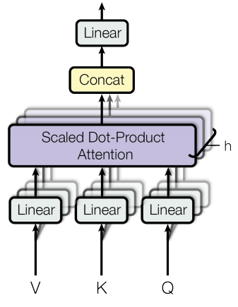

## 한 줄 요약

Transformer 구조에 대해 알아본다.

## Introduction

이전까지 주로 사용해왔던 모델 - RNN, LSTM, GRU- 은 $h_{t}$ 를 계산해야 $h_{t+1}$ 을 계산할 수 있게끔 설계되었다. 이러한 구조는 parallel 하게 계산하기 힘들고 input 에 따라 실행시간이 달라지는 문제 등이 있다. 이 논문에서는 attention 을 극한으로 이용해서 시간에 종속되지 않는 neural network architecture; tranformer 를 제안한다.

## Architecture

기본 구조는 다음과 같다. Decoder 의 input 으로 shifted right 되어 들어가는데, 그 이유는 바로 복사되어 output 이 되는걸 막기 위해서다. 이렇게 함으로써 i 번째 위치의 단어는 i-1,..,1 번째 위치만 보고 추론하게 된다. training 할 때, 처음에는 outputs 에 첫 element 만 start of sentence 토큰을 넣고 inference 하고 그 뒤로 나온 단어를 두 번째 element 로 넣고 inference 하는 식으로 outputs 을 구성해 가면서 inference 한다.

이제 이 그림에 나오는 것들을 하나씩 살펴보겠다.

### Encoder

6 개의 같은 layer 로 구성되어 있고 각 layer 는 2개의 sublayer 로 구성된다. 하나는 multi-head self-attention mechanism 이고 나머지 하나는 potision wise fully connected feed-forward network 이다. 각 sublayer 는 residual block 이 적용된다. 즉, norm(x+sublayer(x)) 의 형태로 sublayer 의 output 이 출력된다. 이를 위해 embedding 을 포함하여 sublayer 의 output dimension 은 512 로 고정한다.

###Decoder

Encoder 와 구조는 비슷한데, encoder 의 output에 대해 multi-head attetion 을 취하는 sub-layer 가 하나 추가된 형태로 layer 을 구성하고 그것이 6개 있다. 하나의 multi-head attention 은 masking 을 취해서 변형시키는데, 이 변형으로 이전 위치의 값이 적용되는걸 막는다. 따라서 i 위치에 대한 예측이 i 이전의 값들을 보고 예측한다는 것을 보장한다.

이제부터 구체적인 sub-layer 들과 구조에 대해 서술하겠다.

### Embeddings & Softmax

구체적으로 어떤 임베딩을 썼는지는 나와있지 않지만 단순한 word 단위 임베딩을 사용한 것 같다. Language model 에서 weight tying 쓰듯이, input 과 output 에서 쓰이는 embeeding layers 와 pre-softmax linear transformaction matrix 에서 동일한 weight matrix 를 사용한다. 또, embedding layers 에 $\sqrt {d_{model}}$ 를 곱해 scale을 바꿔준다.

=> encoder 와 decoder 의 embedding 을 같은 weight matrix 로 사용하면 사전적 의미는 유사하지만 뉘앙스가 다른 단어의 경우를 잘 처리하지 못할 것 같은데 왜 잘되는걸까?

### Positional encoding

### Attention

#### - scaled-dot product attention

#### - Multi-head attention

### Position-wise Feed-forward Networks

###