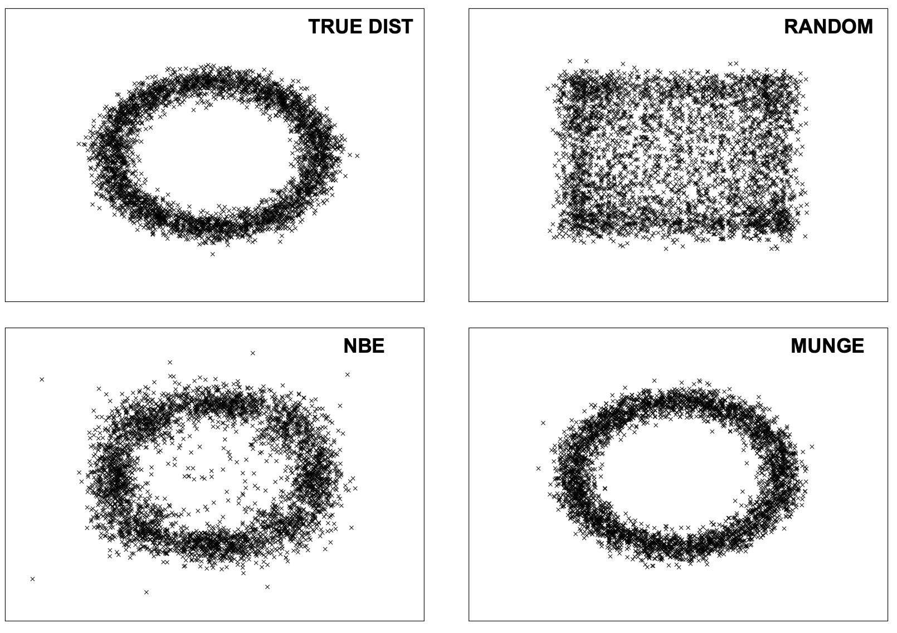

## 한 줄 요약

Ensemble 로 만든 모델을 이용하여 unlabeled 된 데이타를 labeled 시키고, 이렇게 얻어진 labeled 데이타를 작은 neural net 에 학습시킨다.

## **Introduction**

괜찮은 모델 여러개를 ensemble 시키면 좀 더 괜찮은 모델이 나온다. 하지만 이 모델은 너무 크고, 실행 시간이 길기 때문에 컴퓨팅 파워가 작거나 real-time 이 필요한 일이라면 사용하기 곤란하다. 이를 해결하기 위해 저자가 내세운 방법은, neural network 는 univeral approximators property 를 갖고 있으니까 데이타 양만 충분하다면 어떤 함수든 근사할 수 있을 것이란 가정 하에, 많은 데이타를 만들어서 작은 모델에 학습시키겠다는 것이다. 이 때, labeled 된 데이타는 기존의 좋은 모델들을 ensemble 시켜서 얻는다. 결과적으로 neural network 는 기존의 모델만큼의 성능을 낼 수 있을 것이란 기대를 할 수 있다. 이로써 작은 모델로 ensemble 을 여러 모델에 활용한 큰 모델의 효과를 얻을 수 있는 것이다.  unlabeled 된 데이타 조차 얻기 힘든 상황이라면 어떻게 할 것인가? 저자는 그 해결책으로 training set 과 같은 분포를 가지는 data 를 합성하는 MUNGE 라는 방법을 소개한다.

> 빠르고 compact 하고 expressive 한 모델이 충분한 pseudo data 로부터 학습되면 오버피팅이 발생하지 않을 것이다

라는 가정의 근거로 쓰인 univeral approximator property 는 비판적으로 받아들여야 할 부분이다. 이 property 는 what 을 설명해줄 순 있지만 how 를 알려주진 않는다. 구체적으러 어떤 함수로 만들어야하는지에 대한 문제는 상당히 중요하며, 주어진 일에 따라 잘 맞는 neural network 구조가 있는 것은 모든 neural network 이 그 일을 잘 푸는 model 이 되진 않는다는 것의 반증이 된다.

## Method

어떻게 pseudo data 를 만들어 낼 것인지가 중요하다. 합성한 데이타의 분포와 원래 데이타의 분포가 비슷해야 정확한 target function 을 유추할 수 있다. 이를 위해 3 가지 방법; RANDOM, Naive Bayes Estimation, MUNGE 를 사용한다.

### RANDOM

각 attribute 을 marginal distribution 에 속한다고 보고 그것이 normal, uniform 등의 distribution 이라 가정하여 데이타 합성하는 방법. 일차원적이고 conditional 한 관계가 사라진다. 데이타도 기존의 데이타 분포에서 broad한 부분만 나오게된다.

### NBE (Naive Bayes Estimation)

joint distribution 구하고 이 distribution 에서 sampling 하는 방법. joint distribution 은 mixture model 으로 구할 수도 있지만, attribute 가 conditional independent 하다고 가정하고 간단하게 NBE 로 구할 수도 있다. 이 논문에선 NBE 를 사용했는데 bayesian network 를 같은 데이타에서 학습한 것과 비슷한 효과를 냈다.

### MUNGE

이 방법은 full joint distribution 을 구하기 위해 이 논문에서 제안한 알고리즘으로 방식은 간단하다. 데이타에서 하나를 고르고 euclidean distance 로 가장 가까운 벡터를 구한다. 이 두개의 벡터를 $a, b$ 라 하자. 또 $sb = |a[i] - b[i]|/s$ 라 하자.

각 attribute 마다 $p$ 의 확률로 $a[i] = norm(b[i], sb), b[i] = norm(a[i], sb)$ 를 입력한다. 이 과정을 모든 데이타에 해준 뒤 이렇게 만들어진 데이타를 본 데이타에 포함시킨다.

실제 이차원 데이타와 위의 세 가지 데이타 생성 모델을 이용하여 나온 결과물을 시각화한 그래프는 다음과 같다.

## Conclusion

논문의 실험 결과에 따르면, 복잡한 데이타에 대해서 MUNGE 는 생각만큼 잘 동작하지 않았고 실제 데이타가 많다면 그것을 쓰는게 좋다. Model compression 은 예상대로 잘 작동했다. performance 는 조금 줄었는데 실행시간과 크기는 1000배 가량 줄었다.